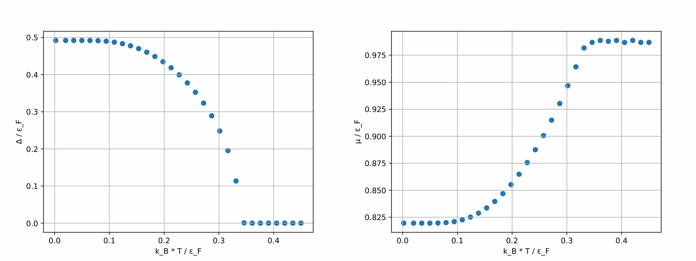

Algorithm designed to find a solution to the Bardeen-Cooper-Schrieffer (BCS) equation, a fundamental equation in the theory of superconductivity.

## Overview
The BCS equation describes the behavior of paired electrons in a superconductor, providing insights into various physical properties such as superconducting critical temperature, energy gap, and density of states. Our algorithm aims to solve this equation numerically, allowing researchers and enthusiasts to explore the behavior of superconducting systems under different conditions.

## Usage
1. Provide input parameters.

2. Run alghoritm.

## Results
Temperature dependence of energy gap and chemical potential

